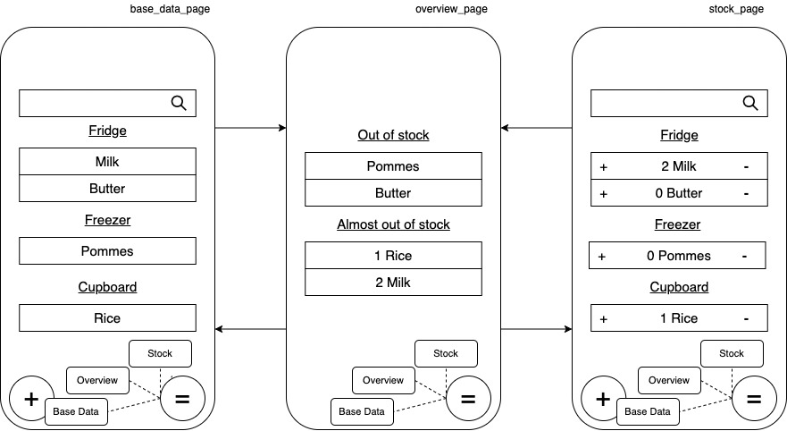
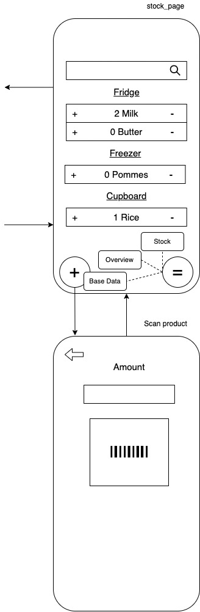

# FoodStock

A Flutter application to keep track of your food stock.

  

## Vision

The following shows the vision of the FoodStock application. It shows the different screens and the interaction between them. There might be various changes in the actual implementation of the app. (There is a full overview in docs/Overview.drawio)

  

### Main Screens

<b>base_data_page:</b>
This screen provides an overview of the products available through the database (e.g., Firebase), the possibility to add/change/delete such products, a search bar, and a menu to switch between the main screens.

<b>overview_page:</b>
This screen provides an overview of the stock items which are out or almost out (controlled due to the threshold field in each product) and a menu to switch between the main screens.

<b>stock_page:</b>
This screen provides an overview of the stock items, the possibility to add items to the stock through scanning the barcode or directly from the database, and a menu to switch between the main screens.

  

### Stock Interaction

<b>stock_page:</b>
TODO

<b>Scan product:</b>
TODO

  

### Add Products

<b>new_name:</b>
TODO

<b>new_threshold:</b>
TODO

<b>new_amount:</b>
TODO

<b>new_mass_unit:</b>
TODO

<b>new_storage_place:</b>
TODO

<b>new_optionals:</b>
TODO

<b>new_scan:</b>
TODO

<b>new_description:</b>
TODO

<b>new_photo:</b>
TODO

  

### Edit/Delete Products

<b>edit_name:</b>
TODO

<b>edit_threshold:</b>
TODO

<b>edit_amount:</b>
TODO

<b>edit_mass_unit:</b>
TODO

<b>edit_storage_place:</b>
TODO

<b>edit_optionals:</b>
TODO

<b>Scan product:</b>
TODO

<b>edit_description:</b>
TODO

<b>Photograph product:</b>
TODO

  
